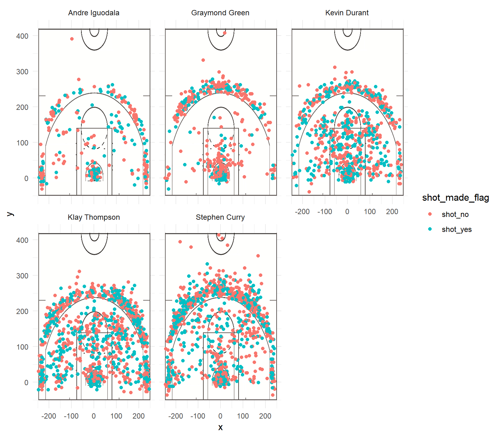

Workout 01
================
Ewen Dai
March 9, 2019

### Best of the Golden State Warriors

Who is the best player of the Golden State Warriors? That depends on how you define the concept of "best". Does "best" mean "most points scored per shot"? or does it mean "most effective at shooting"? In this report, we will analyze the effective shooting percentages of 5 well-known players in the GSW and determine who is the "best" player.

#### The Data and the Stats

The players whose data we will be analyzing today are Andre Iguodala, Graymond Green, Kevin Durant, Klay Thompson, and Stephen Curry. The data has been provided by Professor Gaston Sanchez, and can be found [here](https://github.com/ucb-stat133/stat133-hws/tree/master/data).

For each player, we have calculated the 2PT Effective Shooting %, the 3PT Effective Shooting %, and the overall Effective Shooting %.

##### 2PT Effective Shooting % by Player

    ##             name total made perc_made
    ## 1 Andre Iguodala   420  268 0.6380952
    ## 2   Kevin Durant  1286  780 0.6065319
    ## 3  Stephen Curry  1126  608 0.5399645
    ## 4  Klay Thompson  1280  658 0.5140625
    ## 5 Graymond Green   692  342 0.4942197

##### 3PT Effective Shooting % by Player

    ##             name total made perc_made
    ## 1  Klay Thompson  1160  492 0.4241379
    ## 2  Stephen Curry  1374  560 0.4075691
    ## 3   Kevin Durant   544  210 0.3860294
    ## 4 Andre Iguodala   322  116 0.3602484
    ## 5 Graymond Green   464  148 0.3189655

##### Effective Shooting % by Player

    ##             name total made perc_made
    ## 1   Kevin Durant  1830  990 0.5409836
    ## 2 Andre Iguodala   742  384 0.5175202
    ## 3  Klay Thompson  2440 1150 0.4713115
    ## 4  Stephen Curry  2500 1168 0.4672000
    ## 5 Graymond Green  1156  490 0.4238754

#### Analysis and Discussion

From the above charts, we can clearly see that the overall, the player most effective at shooting is Durant, while the players best at 2 pointers and 3 pointers are Iguodala and Thompson, respectively.

Logically, the player best at shooting would get the most points, and would therefore be the most valuable. However, looking at the above data, it's not clear who the most effective player is: there's a different player for each method we have of looking at Effective Shooting %.

So how can we determine who the best player is? Let's look at the average number of points scored per shot for each player.

##### Average Points per Shot by Player

``` r
iguodala_avg = (tbl_2pt[tbl_2pt['name'] == 'Andre Iguodala', ]['made']*2 + tbl_3pt[tbl_3pt['name'] == 'Andre Iguodala', ]['made']*3)/tbl_pt[tbl_pt['name'] == 'Andre Iguodala', ]['total']

green_avg = (tbl_2pt[tbl_2pt['name'] == 'Graymond Green', ]['made']*2 + tbl_3pt[tbl_3pt['name'] == 'Graymond Green', ]['made']*3)/tbl_pt[tbl_pt['name'] == 'Graymond Green', ]['total']

durant_avg = (tbl_2pt[tbl_2pt['name'] == 'Kevin Durant', ]['made']*2 + tbl_3pt[tbl_3pt['name'] == 'Kevin Durant', ]['made']*3)/tbl_pt[tbl_pt['name'] == 'Kevin Durant', ]['total']

thompson_avg = (tbl_2pt[tbl_2pt['name'] == 'Klay Thompson', ]['made']*2 + tbl_3pt[tbl_3pt['name'] == 'Klay Thompson', ]['made']*3)/tbl_pt[tbl_pt['name'] == 'Klay Thompson', ]['total']

curry_avg = (tbl_2pt[tbl_2pt['name'] == 'Stephen Curry', ]['made']*2 + tbl_3pt[tbl_3pt['name'] == 'Stephen Curry', ]['made']*3)/tbl_pt[tbl_pt['name'] == 'Stephen Curry', ]['total']
```

``` r
iguodala_avg[[1]]
```

    ## [1] 1.191375

``` r
green_avg[[1]]
```

    ## [1] 0.9757785

``` r
durant_avg[[1]]
```

    ## [1] 1.196721

``` r
thompson_avg[[1]]
```

    ## [1] 1.144262

``` r
curry_avg[[1]]
```

    ## [1] 1.1584

Clearly, the player with the highest average points earned per shot is Durant, with Iguodala following extremely close behind.

Now, at this point, it would be easy and is tempting to conclude that Durant is the star player of the GSW. However, that may be too hasty a conclusion.

Let's take a look at the positions from which each player shoots:

##### Shot Charts by Player



Looking at the [GSW Roster](https://www.nba.com/warriors/roster/), all 5 players are either Guards or Forwards or both. Durant and Iguodala are both Forwards and as seen in the above graphic, attempt more 2 pointers than 3 pointers overall. Curry, on the other hand, attempts more 3 pointers overall than 2 pointers.

Maybe the average points gained per shot has some correlation with the player's position? Maybe 2 pointers are easier to shoot than 3 pointers, and that's why they have an higher average point gain? How would we weight these factors? We don't know; we don't have enough data to determine that.

#### Conclusion

From our current data and analysis, we can tentatively conclude that Kevin Durant appears to be the best (and most valuable) player on the GSW under the definition of "best" as the player who earns the most points per shot.

However, the reader must keep in mind that our data and analysis are not comphrehensive. For example, Curry and Thompson have high 3PT Shooting successes, and 3 pointers, by definition, earn more points (and may be more difficult). So should we weight successful 3 pointers as better than 2 pointers? We would need to analyze more data to come to a better conclusion.

#### References

Data used for this article has been pulled from <https://github.com/ucb-stat133/stat133-hws/tree/master/data> and <https://www.nba.com/warriors/roster/>.
